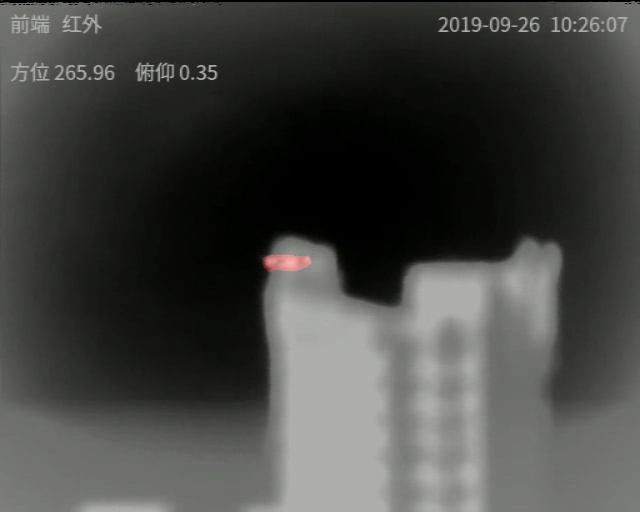
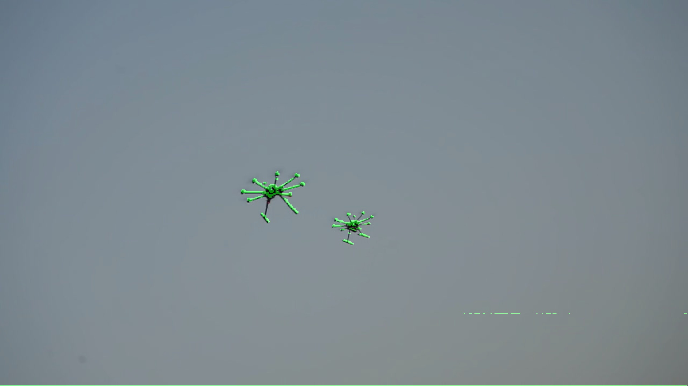
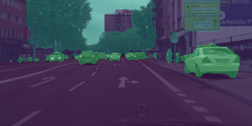
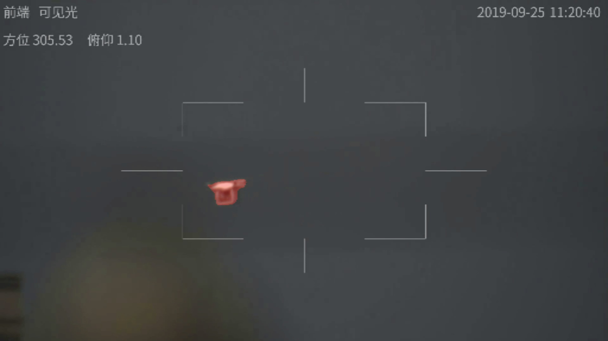
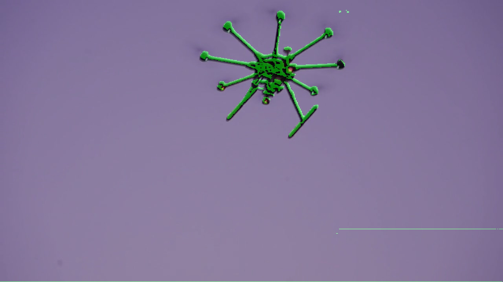

<p align="center">
  
  
  
</p>

# FPGA-based UAV Image Semantic Segmentation

[](https://www.xilinx.com/products/som/kria.html)
[](https://github.com/Xilinx/Vitis-AI)
[](https://pytorch.org/)
[](https://hub.docker.com/r/esmason28/vitis-ai-pytorch-gpu)

---

## 📌 Project Overview

This repository provides an end-to-end framework for training, optimizing, and deploying lightweight deep learning models (e.g., U-Net, ENet) for **real-time UAV aerial image segmentation** onto KR260 FPGA Development Board. 

By leveraging hardware acceleration by the board, this project achieves low-latency and energy-efficient inference suitable for edge deployment on autonomous drones.

---

## 🧰 Prerequisites & Hardware Setup

### Hardware
- **Target FPGA Board:** AMD Xilinx Zynq UltraScale+ KR260 Board
- **Host Workstation:** x86_64 PC with Linux (Ubuntu 20.04 / 22.04 LTS recommended) and NVIDIA GPU (for model training/quantization)
* **GPU Drivers:** NVIDIA GPU Drivers & [NVIDIA Container Toolkit](https://docs.nvidia.com/datacenter/cloud-native/container-toolkit/latest/install-guide.html) installed
* **Docker:** Installed and running
---

### 1. Cloning the Repository

Clone the official Vitis AI repository and checkout **version 3.0**:

```bash
# Clone official Vitis AI 3.0 repository for container runner utilities
git clone [https://github.com/Xilinx/Vitis-AI](https://github.com/Xilinx/Vitis-AI)
cd Vitis-AI
git checkout 3.0
```

### 2. Verify Docker & Pull Image
Make sure Docker is installed properly, then pull the pre-built Vitis AI 3.0 PyTorch GPU container image:

```bash
# Verify Docker installation
docker run hello-world

# Pull the Vitis AI 3.0 PyTorch GPU image from Docker Hub
docker pull esmason28/vitis-ai-pytorch-gpu:3.0.0.001
```

### 3. Launching the Vitis AI Container
Go to the Vitis-AI repo folder and launch the container using the pulled image via the Vitis AI runner script:

```bash
./docker_run.sh esmason28/vitis-ai-pytorch-gpu:3.0.0.001
```

Once inside the Docker container, activate the PyTorch conda environment:

```bash
conda activate vitis-ai-pytorch
```

After that you can start developing the model using this environment. 

For developing process, you can refer to this Model Zoo comparison table from AMD Vitis-AI as reference of their developed model. (https://xilinx.github.io/Vitis-AI/3.0/html/docs/reference/ModelZoo_VAI3.0_Github_web.htm).

---

## ⚙️ Model Quantization & Compilation Workflow

### 1. Setup the overall code

Download the full code of SemanticFPN training code from AMD Vitis-AI by go to "/Vitis-AI/model_zoo/model-listpt_SemanticFPN_cityscapes_256_512_10.56G_3.0/" and download the .zip file from the model.yaml file there.

You can directly use their code for your model development and deployment.

*Notes:
- You need to change several files inside of their setup using the one that I already put in this repo for training using new dataset
- When targeting Kria FPGA boards with Vitis AI 3.0, you may encounter a DPU fingerprint mismatch during runtime. To resolve this, ensure your arch.json file uses the specific Kria DPU fingerprint:

```bash
{
  "fingerprint": "0x101000016010407"
}
```

⚠️ Important: Modify the DPU fingerprint value from "fingerprint":"0x101000056010407" to "fingerprint":"0x101000016010407" to match the target DPU IP on the Kria board.

---

## Happy developing!
- Make new model and train it using new dataset by running the run_train.sh file, it will produce .pt weight file. 
- Then you can use run_quant.sh file perform quantization of your model and convert it into .xmodel. 
- Then use run_compile.sh for FPGA related hardware deployment for the .xmodel output.
---

## 🎯 Target Deployment (Kria Board)

1. Transfer Files: Copy the inference_KR260 to your Kria target board via scp or USB storage. (You can change the .xmodel files inside the folder with your new model)
2. Setup the DPU environment inside of the KR260 FPGA device with OS AMD Linux and activate it. (The FPGA fan should be rotating heavily if its activated). You can follow this link for reference (https://github.com/Xilinx/Kria-PYNQ)
3. Inference with VART: Run the model using python files called segmentation.py to perform segmentation using 1 frame of drone images.

## 🖼️ Model Performance & Results

Below is a demonstration of the semantic segmentation model running on the Kria KR260 board:

### Inference Sample in GPU RTX3090

<p align="center">
  
  
  
</p>

### Inference Sample in KR260 FPGA Development Board
<p align="center">
  
  
</p>